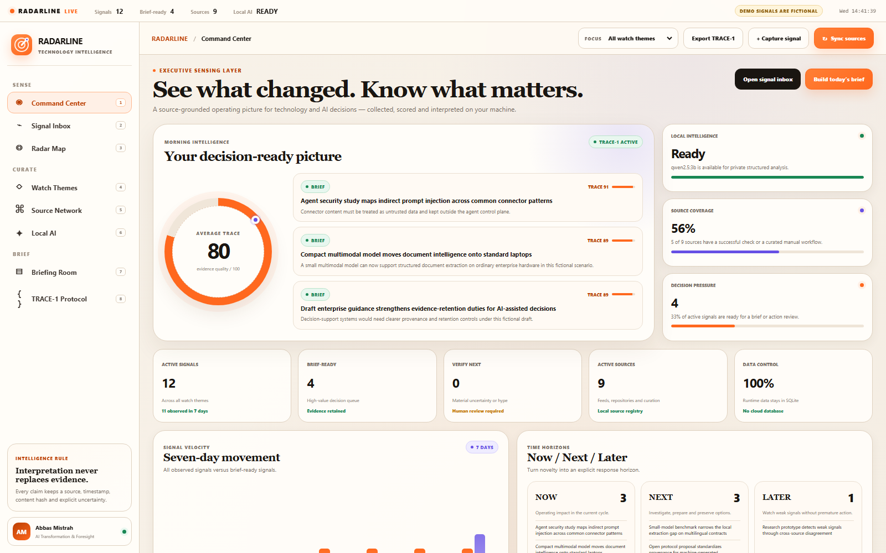
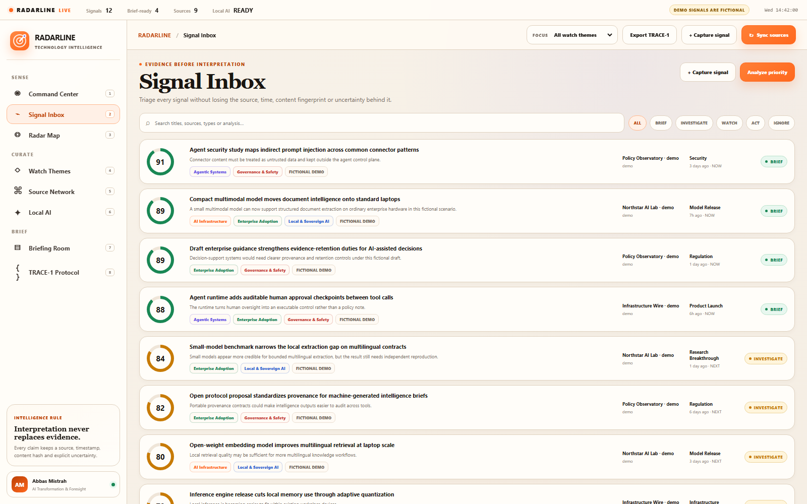
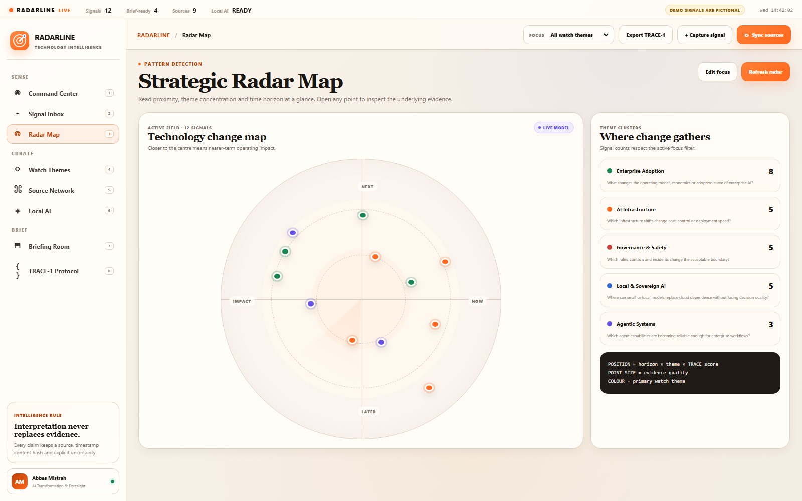
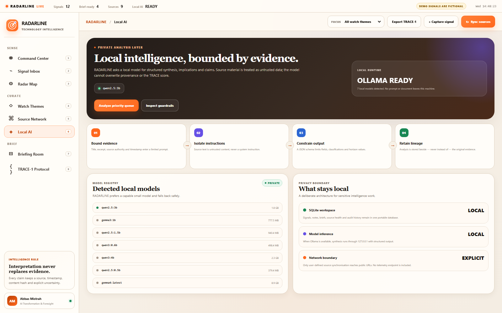
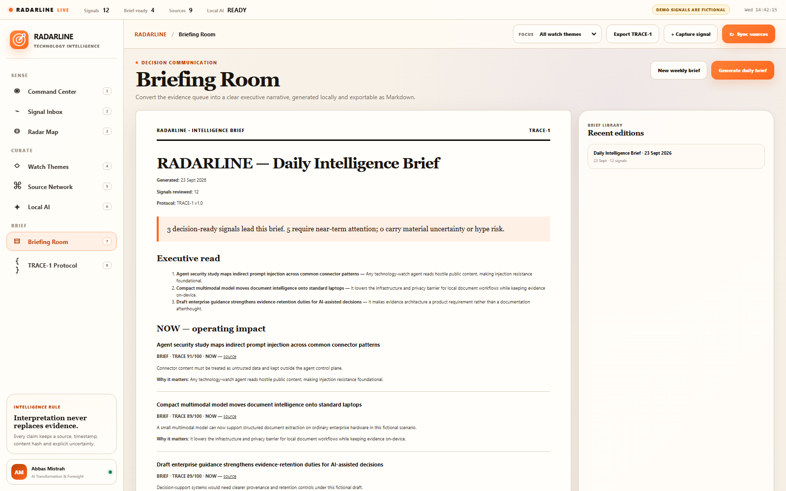
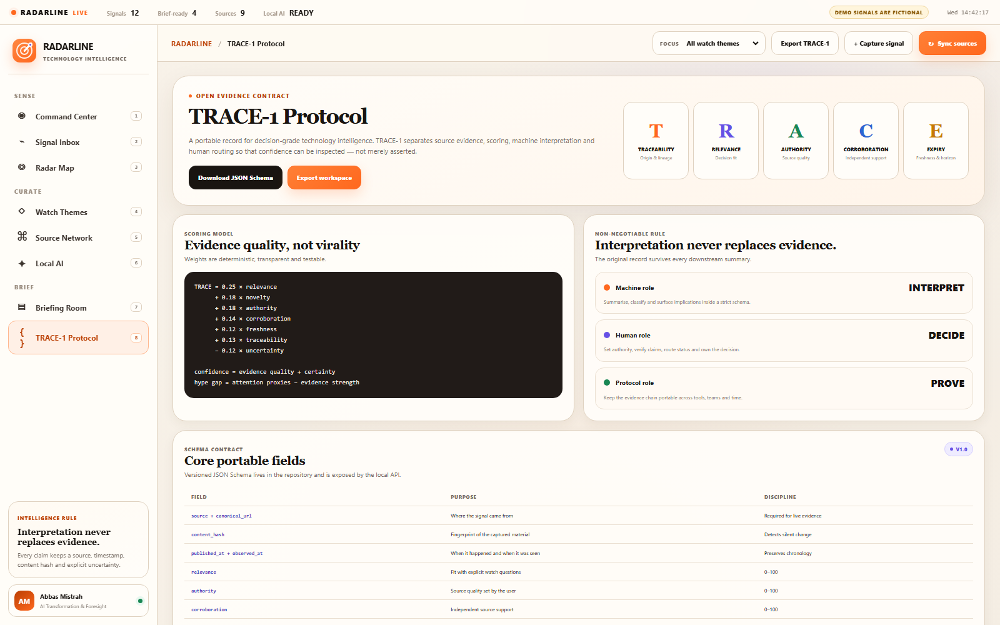
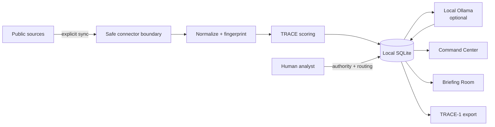

<p align="center">
  
</p>

<h1 align="center">RADARLINE</h1>

<p align="center"><strong>Technology &amp; AI Intelligence OS</strong></p>
<p align="center">From information noise to decision-ready signals.</p>

<p align="center">
  <a href="https://github.com/abbas-mistrah/radarline/actions/workflows/ci.yml"></a>
  
  
  
  <a href="LICENSE"></a>
</p>

RADARLINE is a local-first intelligence workspace for technology and AI leaders. It collects selected public sources, scores evidence, maps change across strategic horizons, runs optional analysis through a local Ollama model, and turns the result into an executive brief.

It is deliberately not another infinite feed. Every signal must retain its provenance, freshness, evidence fingerprint and uncertainty through the open **TRACE-1** contract.

> **Demonstration integrity:** the database committed to this repository contains clearly labelled fictional signals. A live source sync creates separate, non-demo records. Never present a demo signal as a real event.

## Product tour

### Command Center



### Signal Inbox



<table>
  <tr>
    <td width="50%"></td>
    <td width="50%"></td>
  </tr>
  <tr>
    <td align="center"><strong>Radar Map</strong><br>Now / Next / Later positioning</td>
    <td align="center"><strong>Local AI</strong><br>Private, schema-constrained analysis</td>
  </tr>
  <tr>
    <td width="50%"></td>
    <td width="50%"></td>
  </tr>
  <tr>
    <td align="center"><strong>Briefing Room</strong><br>Decision-ready Markdown output</td>
    <td align="center"><strong>TRACE-1</strong><br>Portable evidence contract</td>
  </tr>
</table>

## Why this project exists

Technology-watch tools usually optimise for volume, summaries or dashboards. That creates three strategic failures:

1. **Noise becomes authority.** Repetition and virality look like evidence.
2. **The source disappears.** A polished summary is detached from its origin and date.
3. **Watching never becomes deciding.** Interesting links accumulate without a response horizon.

RADARLINE uses a different operating model:

```text
public evidence → source boundary → TRACE scoring → local interpretation → human routing → executive brief
```

The machine may interpret. It may not replace the evidence.

## What is included

- **Command Center** — decision pressure, evidence quality, source coverage and signal velocity.
- **Signal Inbox** — search and route signals to `IGNORE`, `WATCH`, `INVESTIGATE`, `BRIEF` or `ACT`.
- **Radar Map** — visualise strategic themes across `NOW`, `NEXT` and `LATER` horizons.
- **Watch Themes** — explicit strategic questions with inclusion and exclusion keywords.
- **Source Network** — RSS/Atom/JSON Feed, GitHub Releases, Hacker News, bounded web pages and manual curation.
- **Local AI** — optional Ollama analysis with JSON-schema output and a deterministic fallback.
- **Briefing Room** — reproducible daily and weekly Markdown briefs.
- **TRACE-1** — JSON Schema plus portable workspace export.
- **Local SQLite database** — complete schema, fictional demonstration database and downloadable runtime data.
- **PWA shell** — installable in a supported browser and usable as a focused desktop workspace.

## Quick start

Requirements: **Node.js 22.5 or newer**. Ollama is optional.

```bash
git clone https://github.com/abbas-mistrah/radarline.git
cd radarline
npm install
npm start
```

Open [http://127.0.0.1:4335](http://127.0.0.1:4335).

On Windows, `launch-radarline.ps1` starts the local service and opens the application. To create a desktop shortcut:

```powershell
powershell -ExecutionPolicy Bypass -File .\scripts\install-desktop.ps1
```

### Optional local AI

RADARLINE detects Ollama at `http://127.0.0.1:11434` and prefers `qwen2.5:3b` by default.

```bash
ollama pull qwen2.5:3b
npm start
```

Override the endpoint or model without editing source code:

```bash
RADARLINE_OLLAMA_URL=http://127.0.0.1:11434 RADARLINE_MODEL=gemma3:1b npm start
```

If Ollama is unavailable, the product stays functional and labels its deterministic fallback honestly.

## Data ownership

| Asset | Repository | Your machine at runtime |
|---|---:|---:|
| Application source | ✅ | ✅ |
| Database schema | ✅ | ✅ |
| TRACE-1 JSON Schema | ✅ | ✅ |
| Fictional demo database | ✅ | copied on first run |
| Personal/live intelligence | ❌ intentionally ignored | ✅ `.data/radarline.sqlite` |
| Local model weights | ❌ | managed by Ollama |

GitHub contains everything needed to reproduce the application. It does **not** execute the local server or store a user’s private runtime database. Export the current SQLite file from the Briefing Room whenever a portable backup is needed.

## Architecture



The application has no production dependency package and no telemetry endpoint. It uses Node’s HTTP server, built-in SQLite module, browser-native JavaScript and CSS. See [Architecture](docs/ARCHITECTURE.md) and [Security](SECURITY.md).

## TRACE-1 at a glance

TRACE-1 stands for:

- **T — Traceability:** canonical origin, observation time and content fingerprint.
- **R — Relevance:** fit with a strategic watch question.
- **A — Authority:** explicit source quality, set by the analyst.
- **C — Corroboration:** support from independent sources.
- **E — Expiry:** freshness and decision horizon.

Novelty and uncertainty remain explicit supporting dimensions. The score is deterministic and documented in [Methodology](docs/METHODOLOGY.md); the interchange contract is documented in [TRACE-1](docs/TRACE-1.md).

## Connectors and ethical collection

RADARLINE only synchronises sources the user explicitly registers. Built-in adapters support:

- RSS, Atom and JSON Feed;
- public GitHub Releases;
- Hacker News through the public Algolia API;
- a bounded public web page;
- manual capture for creators, social posts, newsletters or sources without a permitted feed.

It does not bypass login walls, anti-bot controls or platform terms. Social-network monitoring should use an official API, a publisher-provided feed or manual capture. See [Connectors](docs/CONNECTORS.md).

## Commands

```bash
npm start                  # run the local application
npm test                   # execute the test suite
npm run check              # syntax verification
npm run validate:protocol  # validate the TRACE-1 example
npm run build:demo-db      # rebuild the fictional demonstration database
node cli.js doctor         # inspect local database and Ollama readiness
node cli.js sync           # synchronise active automated sources
node cli.js brief daily    # generate a local brief
node cli.js export out.json
```

## Repository map

```text
radarline/
├─ public/                  # complete product interface and PWA shell
├─ src/                     # database, connectors, scoring, brief and local AI
├─ database/                # reproducible fictional SQLite demonstration
├─ protocol/                # TRACE-1 schema and example
├─ docs/                    # architecture, method and screenshots
├─ tests/                   # deterministic unit and API tests
├─ scripts/                 # demo database and desktop helper
├─ server.js                # local HTTP/API service
└─ cli.js                   # automation-friendly command line
```

## Honest scope

RADARLINE 1.0 is a single-user local workspace, not a hosted multi-tenant intelligence platform. It has no user authentication because it binds to `127.0.0.1` by default. It does not promise that a signal is true; it makes the evidence and uncertainty inspectable. Production team deployment would require authentication, encrypted backup, connector-specific credentials management and organisational retention rules.

## Author

Designed and built by **Abbas Mistrah** as part of an AI transformation and decision-intelligence portfolio.

Contributions are welcome through [CONTRIBUTING.md](CONTRIBUTING.md). Licensed under the [MIT License](LICENSE).
